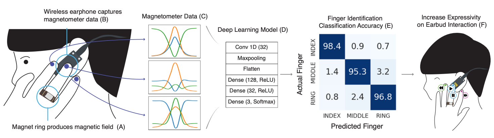

# BudsID
    

BudsID: Mobile-Ready and Expressive Finger Identification Input for Earbuds.     
Jiwan Kim, Mingyu Han, and Ian Oakley    
CHI '25: Proceedings of the 2025 CHI conference on Human Factors in Computing systems.    
[DOI]() | [Video]()    

## About
This open-source provides software, hardware, and classifier for BudsID.

## Software
```
Software/    
├── Arduino_LSM9DS1.zip    
├── Arduino_TensorFlowLite.zip     
├── nanoBuds_v4/    
│   ├── model.h     
│   ├── nanoBuds_v4.ino     
│   ├── src/    
│   │   ├── CapacitiveSensor/    
├── nanoBudsBLE_v5/    
│   ├── index.html    
│   ├── nanoBudsBLE_v5.js    
│   └── libraries/    
└── readMe.txt    
```
- Arduino_LSM9DS1.zip: This archive contains external libraries required for achieving a higher magnetometer sampling rate.
- Arduino_TensorFlowLite.zip: Libraries to enable tinyML on microcontollers
- nanoBuds_v4/:
    - nanoBuds_v4.ino: This Arduino (.ino) file consists of the code responsible for BLE communication and TensorFlow Lite for Microcontrollers.
- model.h: trained model.
- CapacitiveSensor/: This directory contains an external library related to capacitive sensing.
- nanoBudsBLE_v5/:
    - index.html: This webpage provides a user interface for viewing magnetometer, accelerometer, gyroscope data, and capacitive touch inputs via a BLE connection.
- readMe.txt: This is the project's README file, providing additional details and instructions.
- Data preprocessing and classifier code will be shared with github repository with publication of this work.

## Hardware
#### Components:    
Parts - Sensor unit   
> https://store-usa.arduino.cc/products/arduino-nano-33-ble-sense   
> Resistors and 7mm x 7mm x 0.7 plated PCB (for electrode):   
> 	- https://playground.arduino.cc/Main/CapacitiveSensor/   

Parts - Battery unit   
> Voltage booster: https://www.adafruit.com/product/4654   
> Battery: 3.7 li-ion (36 x 17 x 6.5mm)   
> Charger: see included kicad project, based on https://www.adafruit.com/product/2124   

USB micro Cable: any with diameter ~4mm.   

#### Assembly Instructions:   
```
1. Create a sensor or battery module for left or right ear using an appopriate base and top part. 
(sensorBaseLeft.stl plus sensorTop.stl are for a left sensor earbud, powerBaseRight.stl plus powerTop.stl are for a right power earbud).   
2. The battery unit clicks shut.    
3. The sensor unit should be secured with M1 bolts (10mm) and nuts.    
4. Screw the appropriate earLoop (left or right) to the loopToBaseConnector with an M2 bolt (8-12mm) and nut. The nut is in the connector.    
5. Slide the connector onto the sensor or battery base (it will be very stiff).    
6. Push the outerEarStrut into the hole on the earLoop and fit a rubber earbud over it.    
```

## Classifier    
BudsID_classifier.ipynb file illustrate preprocessing and classifier design code.   

## Contact    
Jiwan Kim: [kjwan4435@gmail.com](mailto:kjwan4435@gmail.com)

## Reference    